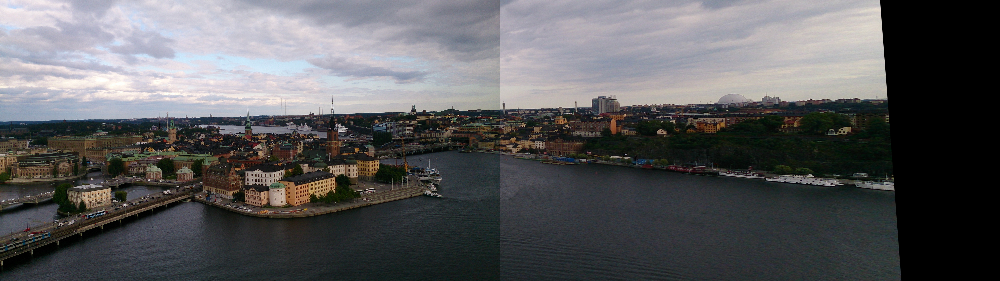
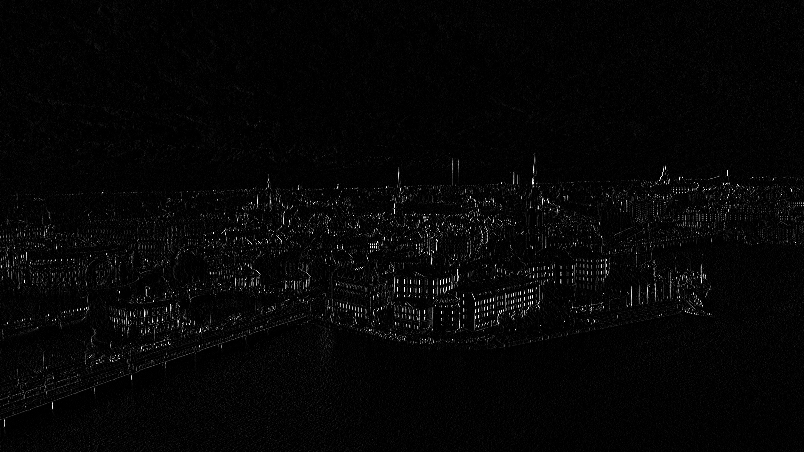
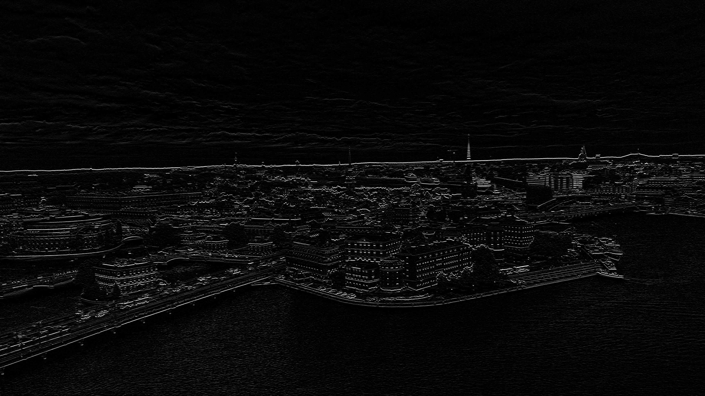

# Panorama 全景影像拼接

<table>
   <tr>
      <td align="center"><b>原�D1</b> </td>
      <td align="center"><b>原�D2</b> </td>
   </tr>
   <tr>
      <td colspan="2" align="center"><b>拼接�Y果</b> </td>
   </tr>
</table>

## ��介
全景影像（Panorama）常用於捕捉完整�鼍埃�尤其是在����照片�o法涵�w整��景�^�r。本�０竿高^ **影像拼接（Image Stitching）** 技�g，�⒍���相同�鼍暗挠跋窈铣梢���完整的全景�D。  

整��流程可分�槲���主要�A段：
1. **特徵�c�z�y（Detect Keypoints）**  
   - 使用 **Harris 角�c�z�y器** 找到影像中重要的角�c。  
   - �� RGB 影像�D�榛译A，�K透�^ Sobel Filter ��算影像梯度。
   
2. **特徵�c描述（Describe Keypoints）**  
   - 使用 **SIFT 描述子** �⒚���角�c的局部梯度��息���a成向量。  
	- (Note: SIFT 原先使用 DOG 找特徵�c)
   - 生成 128 �S descriptor，使特徵�c具有旋�D�c尺度不��性。
   
3. **特徵�c匹配（Match Keypoints）**  
   - 比�^����影像的 SIFT descriptor，透�^ L2 距�x找到匹配�Α�  
   - �O定��值�^�V不可靠的匹配。

4. **匹配�u估（Evaluate Correspondences）**  
   - 使用 **RANSAC** �Y�x出最��定的匹配�Α�  
   - 根��匹配�c��算 **����性矩��（Homography）**，用於影像���R。

5. **影像���Q�c融合（Transform & Blend）**  
   - 利用����性矩���⒁���影像投影到另一��影像的平面上。  
   - �χ丿B�^域�M行融合，使拼接後的全景�D自然�B��。

## 特徵�c�z�y（Detect Keypoints)
目的是在影像中找到具有�@著特徵的�c，�@些�c通常是角�c或����交叉��。

### Harris 角�c�z�y器
Harris 角�c�z�y器是一�N基於影像梯度的角�c�z�y方法。其核心思想是利用影像在不同方向上的��化�碜R�e角�c。
1. **��算影像梯度**  
   使用 Sobel Filter ��算影像在 x 和 y 方向的梯度 (�����z�y)，分�e得到 Ix 和 Iy。
   Sobel Filter 的卷�e核如下：
   

   |              |                                 x 方向                                 |                                 y 方向                                 |
   | :----------: | :--------------------------------------------------------------------: | :--------------------------------------------------------------------: |
   | Sobel Kernel | $\begin{bmatrix} -1 & 0 & 1 \\ -2 & 0 & 2 \\ -1 & 0 & 1 \end{bmatrix}$ | $\begin{bmatrix} -1 & -2 & -1 \\ 0 & 0 & 0 \\ 1 & 2 & 1 \end{bmatrix}$ |
   |    梯度�D    |                                                 |                                                 |
      - **x 方向 kernel**（Ix）：���y�Q��（垂直����），�λ�平方向的��化�^敏感。
   - **y 方向 kernel**（Iy）：���y�M��（水平����），�Υ怪狈较虻淖�化�^敏感。

2. **��算 M 矩���c角�c����值 R**  
   以每��像素�橹行模���算其��域�鹊奶荻瘸朔e和，得到 Harris 矩�� M：
   
   $M = \begin{bmatrix} \sum I_x^2 & \sum I_x I_y \\ \sum I_x I_y & \sum I_y^2 \end{bmatrix}$
   
   接著��算角�c����值：
   
   $R = \det(M) - k \cdot (\operatorname{trace}(M))^2$
   
   其中 $k$ 通常取 0.04~0.06。
   

## Todo List
- [x] Harris Corner Detection
	- [ ] Switch to DOG
- [x] SIFT Descriptor
- [x] Feature Matching
- [ ] RANSAC
- [ ] Homography
- [ ] Image Warping
- [ ] Image Blending
- [ ] Documentation